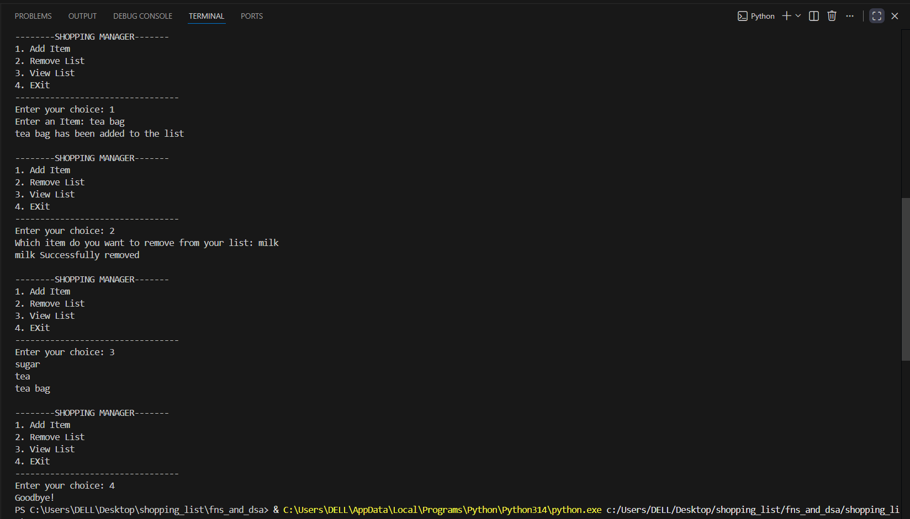

# Shopping List Manager

## Description
A simple shopping list manager built with Python that allows users to add items, view the current list, and remove items dynamically.

## Features
- Add items to your shopping list
- Remove items from your shopping list
- View all items in your shopping list
- Handles invalid menu choices gracefully

## How to Run
1. Make sure you have Python installed
2. Clone the repository
3. Navigate to the fns_and_dsa folder
4. Run the script:
```
python shopping_list_manager.py
```

## Usage Example
```
Shopping List Manager
1. Add Item
2. Remove Item
3. View List
4. Exit
Enter your choice: 1
Enter the item to add: Milk
Milk has been added to the list.
```
## Screenshot



